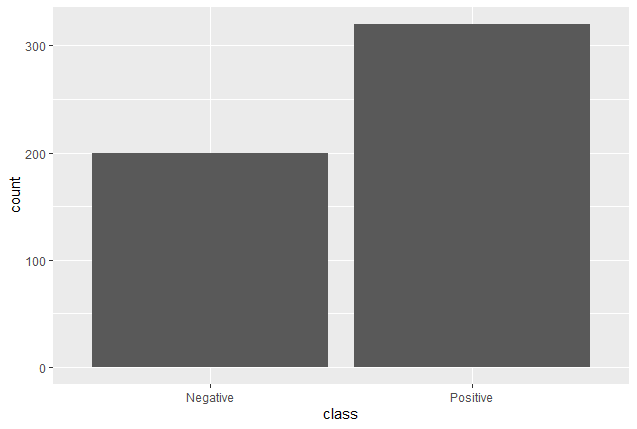
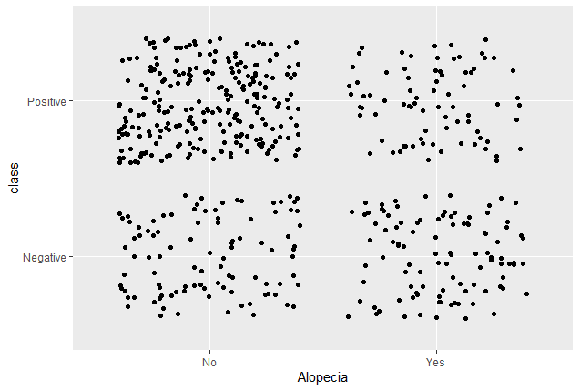

```{r setup, include=FALSE}
knitr::opts_chunk$set(echo = TRUE)
library(tidyverse)
library(caret)
library(data.table)
library(vcd)
library(randomForest)
library(ROCR)
data_set <- read.csv("https://archive.ics.uci.edu/ml/machine-learning-databases/00529/diabetes_data_upload.csv")
```

# Introduction

Diabetes is a disease that occurs when a person's blood glucose is too high.  Blood glucose is the body's main source of energy and comes from the food we eat.  The pancreas produces a hormone called insulin that helps glucose get into our cells.  When a person is not able to make enough, or any insulin they are then diabetic.

According to the "National Diabetes Statistics Report, 2020," 34.2 million Americans or, just over 10%, have diabetes.  My father was one of the 34.2 million and sadly, this year, lost his battle with the disease.  It is a ruthless, terrible disease that does not discriminate among race, age, gender, or social class.  

A more frightening statistic is that 88 million American adults, nearly 1 in 3, have prediabetes.  Fortunately for them, they still have an opportunity to change their future so early detection is very important.  

The goal of this HarvardX PH125.9x Data Science Capstone Project is to use data science skills to develop a model that can predict diabetes diagnoses using early health predictors.  The dataset for this project is the Early Stage Diabetes Risk Prediction Dataset consisting of 520 patient observations of the following 17 variables:

* Age
* Gender
* Polyuria
* Polydipsia
* Sudden Weight Loss
* Weakness
* Polyphagia
* Genital Thrush
* Visual Blurring
* Itching
* Irritability
* Delayed Healing
* Partial Paresis
* Muscle Stiffness
* Alopecia
* Obesity
* Class

The dataset was collected using direct questionnaires from the paitents of Sylhet Diabetes Hospital in Sylhet, Bangladesh and can be found at https://archive.ics.uci.edu/ml/machine-learning-databases/00529/diabetes_data_upload.csv.  

I performed the key steps learned during the course to accomplish the goal. The steps included exploring the data to understand its structure, visualizing the data to uncover distributions and relationships, developing models using Logistic Regression and Random Forest Classification to satisfy the goal, then testing it to find which model was most accurate.  


# Methods and Analysis

My first step was to download the dataset from the ICS website and convert it to a data frame.  I then performed exploratory data analysis to learn more about the data.  Taking a glimpse of the data, it seems only the variable "Age" is numeric.  The other 16 variables are character strings and appear to only consist of yes/no responses.

```{r}
glimpse(data_set)
```

My next step was to confirm that the remaining variables only contained yes or no values by checking the number of unique values in the set.

```{r}
sapply(data_set, function(x) length(unique(x)))
```

The results reflected that all but "Age" contained only two unique values.  I also checked to see if there were any "NA" or blank values in the data set and there were none.  Because the dataset was complete I did not need to perform any data cleaning or imputation.

The last variable in the dataset was "class" and reflected whether or not the respondent had diabetes (Positive) or not (Negative).  This was the variable the model needed to predict so I converted it from a character string to a factor.  

```{r}
data_set$class <- factor(data_set$class)
```
I then plotted the class values in a bar graph to see how the Positive and Negative values were distributed.  As shown, there were approximately 50% more Positive outcomes than Negative with 320 of the 520 patients having diabetes.

```{r, out.width='75%', fig.align='center', fig.cap='*Chart reflects the distribution of diabetic respondents.*', echo=FALSE}

```

Since the variable "Age" was the only numeric, continuous variable, it seemed reasonable to visualize and observe the distribution.  The ages of the respondents varied from 16 to 90 years old and were summarized as:

```{r}
summary(data_set$Age)
```

The ages followed a near-normal distribution as shown in the graph on the left.  Also notable was the minor impact age had on diabetic diagnoses as the boxplot on the right reflects.

```{r, out.width='49%', fig.align='center', fig.show='hold', fig.cap='*Age distribution of respondents.*', echo=FALSE}
knitr::include_graphics(c('Images/AgeDistribution.png','Images/AgeDiabeticBoxplot.png'))
```

Age did not seem to be a relevant factor in diagnosing diabetes.  Therefore, it seemed prudent to examine how the other variables would relate to a diabetic outcome.  In order to accomplish this, I converted all variables other than "Age" and "class" to factors then built contingency tables to see if any symptoms stood out more than others.

```{r}
x = c()
x = names(data_set)
x = x[-17] # Remove class
x = x[-1] # Remove Age
# Convert remaining variables to factors then print contingency tables
for (i in x){
  data_set[,i]=as.factor(data_set[,i])
}
```

It would be more apparent if the numbers were larger in opposing corners of the table.  For example, if there were larger numbers in the "Negative/No" and "Positive/Yes" corners then it would appear that the condition impacted the diabetic outcome.  The three tables that reflected this pattern most noticeably were the variables, "Polyuria," "Polydipsia," and "Alopecia" as shown below.

* Polyuria
```{r}
table(data_set$Polyuria, data_set$class)
```

* Polydipsia
```{r}
table(data_set$Polydipsia, data_set$class)
```

* Alopecia
```{r}
table(data_set$Alopecia, data_set$class)
```

The next step was to perform a visualization of the three variables based on the initial evaluation of the tables.  The scatterplots clearly show correlation between a patient having Polyuria and Polydipsia symptoms and having diabetes.  

```{r, out.width='50%', fig.align='center', fig.show='hold', echo=FALSE}
knitr::include_graphics(c('Images/PolyuriaScatterplot.png','Images/PolydipsiaScatterplot.png'))
```

The scatterplot for Alopecia was not so distinct.

```{r, out.width='50%', fig.align='center', echo=FALSE}

```

Scatterplots can be deceiving at times so I prepared two mosaic plots to further visualize the contingency tables in question.  The plots included shading to reflect the level of the residual for the combination of levels.  The darker shades represent opposite extremes for what would be the expected number of observations with independent variables.

```{r, out.width='75%', fig.align='center', fig.show='hold', echo=FALSE}
knitr::include_graphics(c('Images/PolyuriaMosaic.png','Images/PolydipsiaMosaic.png'))
```

As shown, Polyuria and Polydipsia are seemingly strong indicators of a person's diabetic outcome.

I used two modeling approaches to analyze the data set; logistic regression and random forest.  In both cases, I used the same training and testing subsets of the dataset.  The training set consisted of 80% of the observations while the testing set consisted of the remaining 20%.  

```{r, echo=FALSE}
set.seed(1)
test_index <- createDataPartition(y = data_set$Age, times = 1, p = 0.2, list = FALSE)
test_set <- data_set[test_index,]
train_set <- data_set[-test_index,]
```

**Logistic Regression**

This method is useful for predicting binary outcomes such as this.  The Generalized Linear Model was fit using the glm() function.  The summary of the model revealed "PolyuriaYes" and "PolydipsiaYes" had influenced class most positively with estimates of 4.05376 and 4.68610 respectively.
```{r}
LR_model <- glm(class ~.,family=binomial(link='logit'),data=train_set)
summary(LR_model)
```

I used the anova() function to test for the significance of the model using the chi-square test.  This tests the model based on the change in deviance when the predictors of my model are added to the null model.  

```{r}
anova(LR_model, test='Chisq')
```

The next step was to predict the outcomes in the test set.  Once I performed the predict() function, I needed to convert the results into a binary "Positive" or "Negative" so that they could used as factors.  I then created a confusion matrix to assess the results.

```{r}
LR_result <- predict(LR_model, newdata = test_set, type='response')
LR_result <- ifelse(LR_result > 0.5,"Positive","Negative")
LR_result <- as.factor(LR_result)
confusionMatrix(data=LR_result, reference=test_set$class)
```

This resulted in a 93.4% accuracy with 97.5% sensitivity and 90.9% specificity.  

Accuracy reflects whether the test actually measured what it was supposed to and gives a general understanding of the performance of a classifier.  Sensitivity is the measure of the ability for a prediction model to select instances of a certain combination of variables and corresponds to the True Positive rate.  Conversely, specificity corresponds to the True Negative rate or the probability that the diagnosis is non-diabetic when the patient is in fact, non-diabetic.  

These are good results, however; I wanted to better evaluate the performance of the model.  I learned the Area Under Curve - Receiver Operating Characteristics (AUC-ROC) curve is "one of the most important evaluation metrics for checking any classification model's performance."  More can be found on this topic at https://towardsdatascience.com/understanding-auc-roc-curve-68b2303cc9c5.  

The graph below reflects the ROC curve or, the performance of the model.  It is a comparison between the sensitivity and specificity.  If a model's performance is more accurate, the line will curve more toward the upper left corner.  If the model's performance is less accurate, it will follow a linear, 45-degree line from bottom left to upper right more closely.

```{r}
prediction1 <- predict(LR_model, newdata=test_set, type="response")
ROC_pred <- prediction(prediction1, test_set$class)
ROC_perf <- performance(ROC_pred, measure = "tpr", x.measure = "fpr")

plot(ROC_perf, colorize = TRUE, text.adj = c(-0.2,1.7), print.cutoffs.at = seq(0,1,0.1))
```

Finally, I produced the AUC score to see precisely how much the model is able to predict a diabetic outcome or not.  The higher the AUC, the better it is able to predict an outcome.

```{r}
auc <- performance(ROC_pred, measure = "auc")
auc <- auc@y.values[[1]]
auc
```

Here, the AUC is an impressive .98333.

**Random Forest Classifier**

The second modeling approach I used was the Random Forest Classifier.  This is a classification algorithm that uses several individual decision trees that each generate a class prediction.  In the end, the class that is produced the most often becomes the model's prediction.  Like the logistic regression method, I began by creating the model.

```{r}
RF_model <- randomForest(factor(class) ~ Age + Gender + Polyuria + Polydipsia + sudden.weight.loss + weakness + Polyphagia + Genital.thrush + visual.blurring + Itching + Irritability + delayed.healing + partial.paresis + muscle.stiffness + Alopecia + Obesity, data = train_set)
```

Then, I plotted the error rate of the model.

```{r}
plot(RF_model, ylim = c(0, 0.36))
legend("topright", colnames(RF_model$err.rate), col = 1:3, fill = 1:3)
```

The OOB line is the overall error rate and appears to be very low at around 5%.  My next effort was to visualize the importance of the variables that the model produced.  A very useful way to see this is in a bar graph.

```{r}
# Rank the variables and plot on bar graph
importance <- importance(RF_model)

# Lower Gini means stronger factor in partitioning data into classes
varImportance <- data.frame(Variables = row.names(importance), Importance = round(importance[ ,'MeanDecreaseGini'],2))

rankImportance <- varImportance %>%
  mutate(Rank = paste0('#',dense_rank(desc(Importance))))

ggplot(rankImportance, aes(x = reorder(Variables, Importance), y = Importance, fill = Importance)) +
  geom_bar(stat='identity') + 
  geom_text(aes(x = Variables, y = 0.5, label = Rank), hjust=0, vjust=0.55, size = 4, colour = 'red') +
  labs(x = 'Variables') +
  coord_flip() + 
  theme_bw()
```

Interestingly, the top three most important variables were Polyuria, Polydipsia, and Gender; the same three variables that influenced the outcome most significantly in the logistic regression method as well.

The final step to test this method was to see how it performed on the test set of data.

```{r}
prediction2 <- predict(RF_model, test_set)
RF_predictions <- data.frame(test_set, class=prediction2)
table(RF_predictions$class)
table(test_set$class)
```

The results were identical between the predicted outcomes in the test set and the actual outcomes in the full dataset.  The model predicted 66 of 106, or 62% of the patients would be diagnosed with diabetes.  In comparison, the actual number of patients with diabetes in the entire data set was 320 of 520, also 62%.

# Results

I analyzed this dataset using both linear regression and random forest classifier and found the latter to be a better predictor of a diabetic diagnosis.  The linear regression method proved to be very accurate with a .9833 AUC meaning, it is nearly 100% accurate.  Random forest, however; proved to be 100% accurate on this dataset. 

# Conclusion and Future Work

The goal of this HarvardX PH125.9x Data Science Capstone Project was to use data science skills to develop a model that could predict diabetes diagnoses using early health predictors from the Early Stage Diabetes Risk Prediction Dataset.  It was motivated by personal experience witnessing the devastating effects of the disease and a desire to help others detect the warning signs early before it is too late.  

Certain variables proved to be more significant than others in this study including polyuria and polydipsia.  While the variables were very impactful in this dataset, their significance may be overstated due to the relatively small size of the dataset when you consider just how many people suffer from this disease.  With only 520 patient observations based on simple yes or no responses, it is difficult to state that the findings are completely reliable.  It would be very beneficial to use a larger dataset with precise medical measurements in future work.

